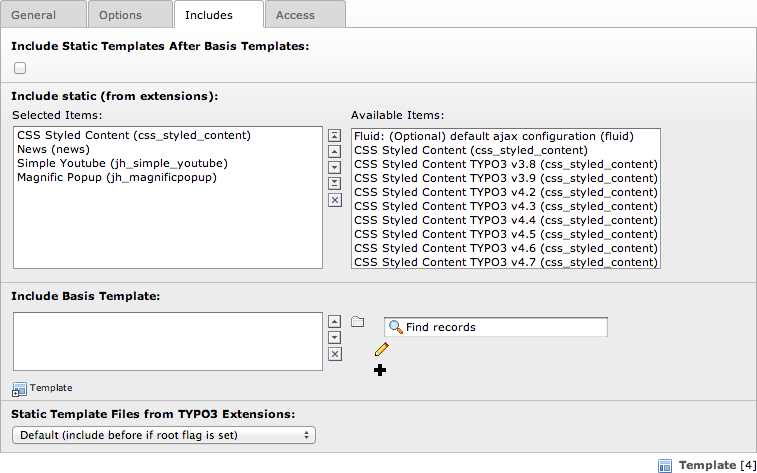

.. ==================================================
.. FOR YOUR INFORMATION
.. --------------------------------------------------
.. -*- coding: utf-8 -*- with BOM.

.. ==================================================
.. DEFINE SOME TEXTROLES
.. --------------------------------------------------
.. role::   underline
.. role::   typoscript(code)
.. role::   ts(typoscript)
   :class:  typoscript
.. role::   php(code)
.. highlight:: guess

Lightbox
^^^^^^^^

For images
""""""""""

To use the lightbox, include static “Magnific Popup
(jh\_magnificpopup)” to your template.

Attention: This Extension uses 'page.jsFooterInline' in TypoScript. If
you use an other extension that uses this command (like
EXT:perfectlightbox or EXT:t3colorbox) make sure you include the
static template of 'Magnific Popup (jh\_magnificpopup)' at last.If you
use EXT:yag\_theme\_magnificpopup the order of these both statics does
not matter.

Now you may customize your extension with the Constant Editor.

For RTE images
""""""""""""""
If you want to enable support for images in RTE, also add static template 'Magnific Popup for RTE (jh\_magnificpopup)'. By default, all images within a p-tag will be displayed as a gallery. To change this behaviour edit constant 'plugin.tx_jhmagnificpopup.magnificpopup.support.rteLightbox'.

For whole page
""""""""""""""

(Available since version 0.3.0)

If you want to open all images of a page in one lightbox add the following TypoScript to your template-setup:

.. code-block:: typoscript

	page.jsFooterInline.109.variables.selector >
	page.jsFooterInline.109.variables.selector = TEXT
	page.jsFooterInline.109.variables.selector.value = body
