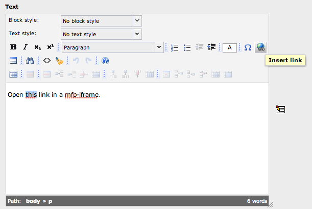
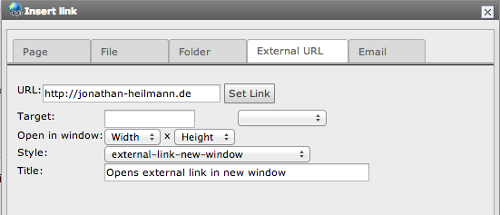
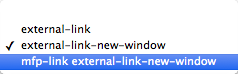

.. ==================================================
.. FOR YOUR INFORMATION
.. --------------------------------------------------
.. -*- coding: utf-8 -*- with BOM.

.. ==================================================
.. DEFINE SOME TEXTROLES
.. --------------------------------------------------
.. role::   underline
.. role::   typoscript(code)
.. role::   ts(typoscript)
   :class:  typoscript
.. role::   php(code)

Iframe for RTE
^^^^^^^^^^^^^^

Insert a link as usually:

Magnific Popup is available for Pages, Files and External URLs.

To use Magnific Popup select the Style “mfp-link [...]”

Klick “Set Link” and you are done. The link opens in a Magnific Popup
iframe now.

