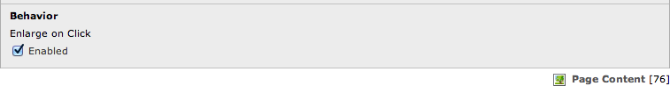

.. ==================================================
.. FOR YOUR INFORMATION
.. --------------------------------------------------
.. -*- coding: utf-8 -*- with BOM.

.. ==================================================
.. DEFINE SOME TEXTROLES
.. --------------------------------------------------
.. role::   underline
.. role::   typoscript(code)
.. role::   ts(typoscript)
   :class:  typoscript
.. role::   php(code)

Lightbox for images
^^^^^^^^^^^^^^^^^^^

Create a content element “Images” or “Text & Images” as normal and set
“Enlage on Click”.

Using images in RTE with activated “Click to enlarge” is a second way
to use Magnific Popup.

